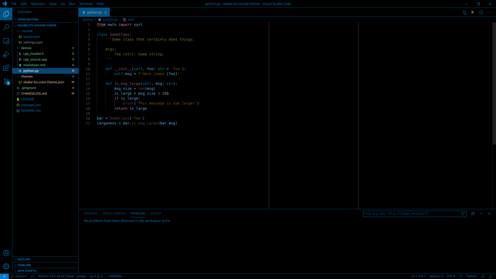
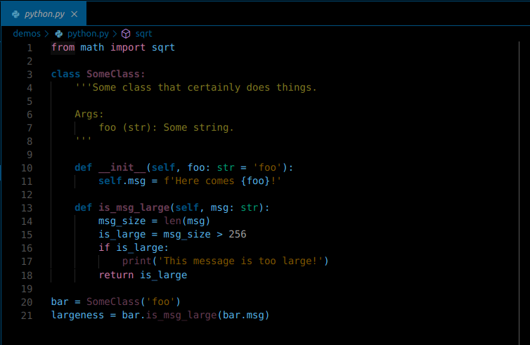
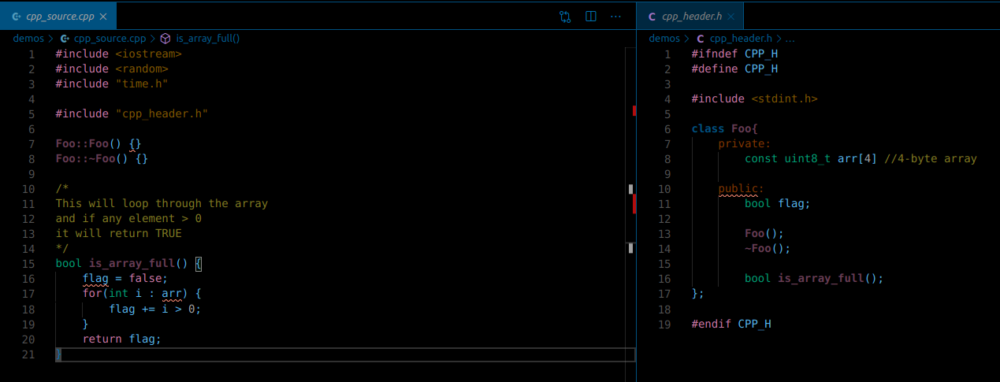
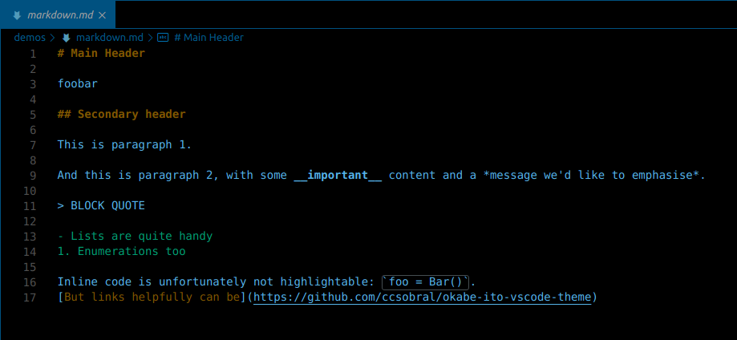
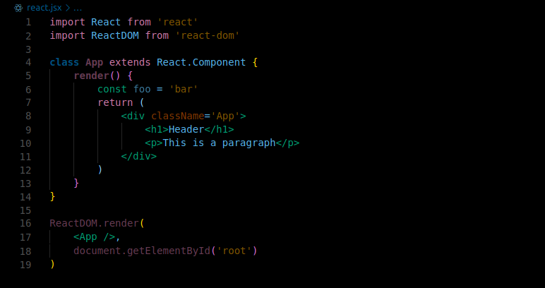

# okabe-ito-vscode-theme
A VSCode dark theme, based on a colourblind-friendly palette by [Masataka Okabe and Kei Ito](https://jfly.uni-koeln.de/color/#pallet), who have conducted research on this subject.

The motivation for creating this theme came about because:
1. I could not find a very-dark theme that I had no reservations about
2. I had been researching tColour Universal Design and thought the Okabe-Ito palette generally looked really nice.

__small disclaimer__: I'm not colourblind in any way, so can't actually test the effectiveness of this theme myself.
If you have found it (not) useful, do let me know!

__P.S.__ Yes it is a very dark theme. 
I'll probably make lighter versions that still follow the palette at some point.
If you'd find that useful, let me know.

---

 

## Installation
1. Launch Visual Studio Code
2. Go to the __Extensions__ menu in the activity bar (or press `Ctrl+Shift+X`).
3. Search for `Okabe Ito`
4. Click __Install__, then reload VSC if prompted
5. In the menu bar, go to `File > Preferences > Color Theme` and select `Okabe Ito`!

---

 

## Screenshots

 

### Python

 

### C++

 

### Markdown

 

### React/JS
